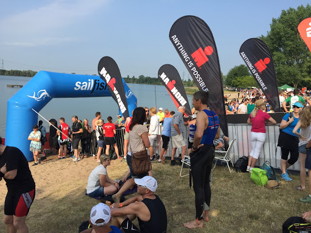
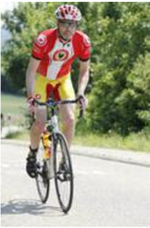
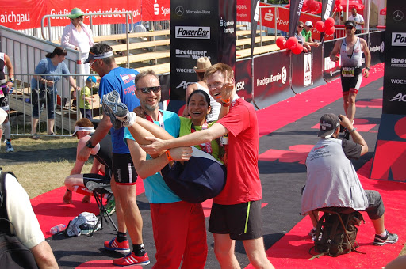

---
title: 'Team Triton: IRONMAN 70.3 June 7th, 2015 Kraichgau'
date: Jul 1, 2015
permalink: /posts/2015/07/blog-post-1/
tags:
  - ironman703
  - swim
 ---

One day I came across this poster at EWI, TU Delft with two men in orange with an exciting title:

I was drawn to it and the next thing I did was to show up at their place. We discussed what it was going to be about and I learnt that it would involve open water swimming with a distance of 1.9 km. Previously, I did  participate in swimming competitions, but they were all held at indoor pools. The last time I indulged in competitive swimming was in 2004 (at high school). That was ten years ago!  But there was one thing I was absolutely sure of, about myself, that I was more a long distance swimmer/runner rather than a sprinter. In my mind I could nearly do the entire leg. Thats 40 times a 50 metre pool amounting to 2 km. That wasn't impossible! But then I had never stepped into open water for swimming that kind of distance. 

After approval from our respective families, we finalized our race event ie.  IRONMAN 70.3 Kraichgau, to be held on June 7th 2015. 

Headings are cool
======

You can have many headings
======

Aren't headings cool?
------
